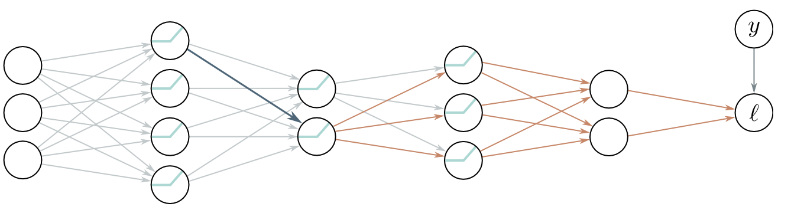

<div align="center"> 

# Simple automatic differentiation in NumPy


</div>

This repo implements a minimal example of neural network backpropagation (specifically reverse-mode automatic differentiation) with NumPy. It is a straightforward extension of [micrograd](https://github.com/karpathy/micrograd) to vectorized operations using NumPy. To keep the code as simple as possible, changes to micrograd were only made where necessary: adding a `__matmul__` and `sum()` method to the engine, handling array shapes / broadcasting, and adding the commonly used cross entropy loss. Many other operations such as e.g. tensor slicing are missing, so this is not meant to be a complete autodiff engine. The `demo.ipynb` notebook provides an example for training an MLP for classification.



[image source: Prince, S.J., "Understanding Deep Learning"] 

To run the code, install in a Python >= 3.9 environment with
```
pip install -e .
```

To run the notebook, the following packages are additionally required:
```
pip install notebook
pip install scikit-learn
pip install matplotlib
```

Testing requires `pytest` and `torch`, and can be executed with
```
python -m pytest
```

## Credit

[micrograd](https://github.com/karpathy/micrograd) by karpathy

## Resources

[1] Bishop, C.M., Bishop, H., "Deep learning: Foundations and concepts", Springer Nature, 2023

[2] Prince, S.J., "Understanding deep learning", MIT press, 2023

[3] Goodfellow, I. et al., "Deep learning", MIT press, 2016